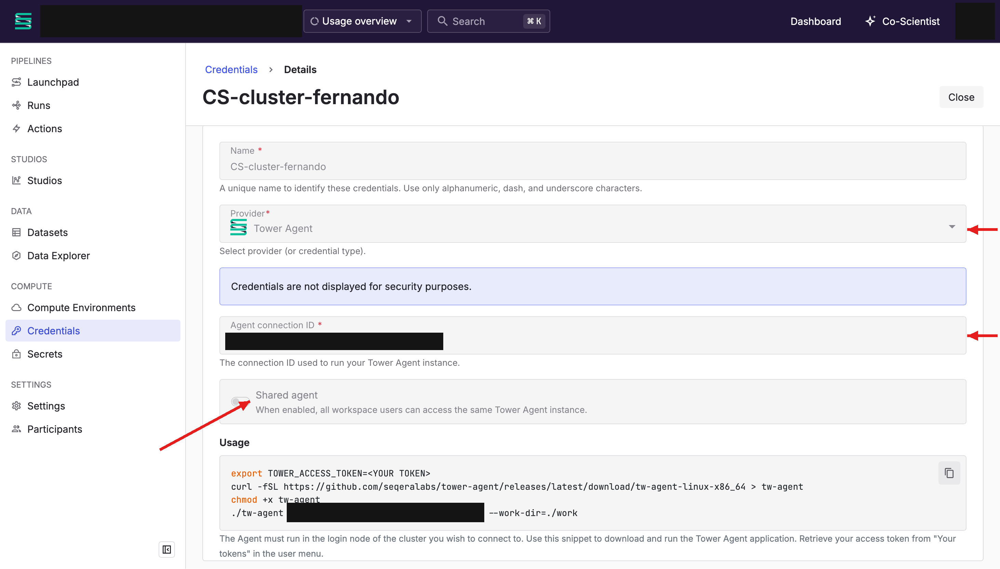
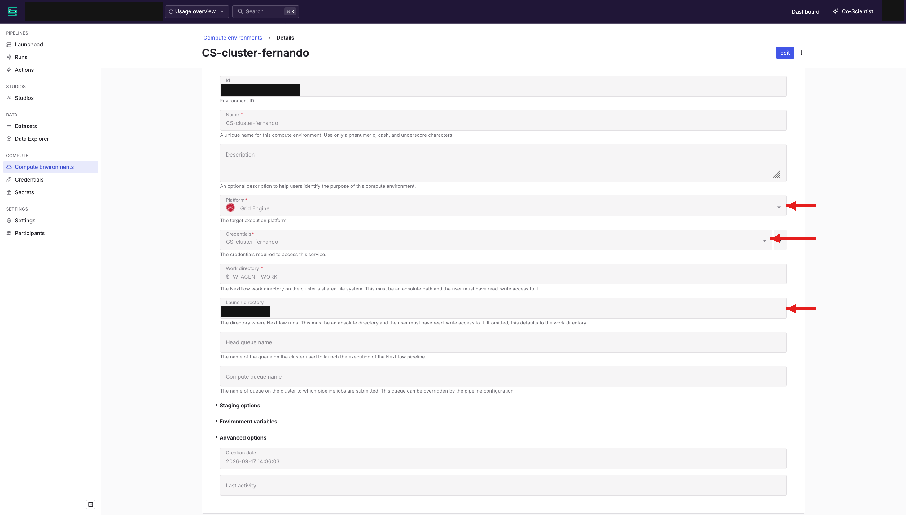
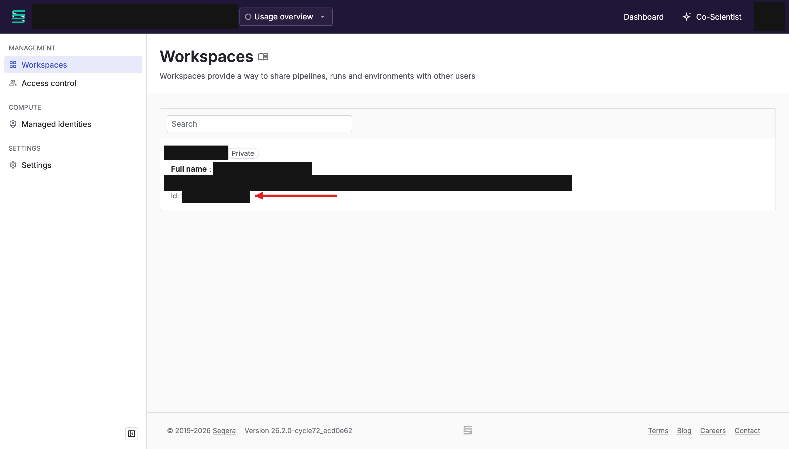

## 1. Create the workspace credential

Before creating a tower connection to the CS cluster, first go to the **credentials** section in your workspace, and create a **new credential** by clicking on `Add workspace credential`.

Select a name for the new credential, choose `Tower Agent` as the provider, and leave the `Agent connection ID` with the default value. Finally, enable `Shared agent`.



Now, if you try to add this credential by clicking on `Add`, you'll get an error message saying `The agent is not online - You need to run the agent before proceeding`. **Don't close this window. You will finish creating your credential later.**

## 2. Install and run the Tower Agent on the cluster

Go to the terminal, and ssh into the CS cluster and the key node (where Nextflow is supposed to run, `ssh askey`). To create tower connection from the CS Cluster, in your `$HOME`, download tower agent binary:

```
curl -fSL https://github.com/seqeralabs/tower-agent/releases/latest/download/tw-agent-linux-x86_64 > tw-agent
chmod +x ./tw-agent
```

Move the binary to `./bin`:

```
mkdir -p ~/bin
mv tw-agent ~/bin/
```

Create a new working directory for the launchpad:

```
mkdir -p ~/work
```

**THIS IS FOR THE LAUNCHPAD.** Change it to a more appropriate directory - such as a project directory if available -, as this is going to be Nextflow's working directory if the pipeline is launched within the platform. Otherwise, use `-with-tower` and `-w` if launching the pipeline from from the CLI.

In the same directory, open a new `tmux` session:

```
tmux new -s tower-agent
```

Once inside the `tmux` session, run the agent:

```
export TOWER_ACCESS_TOKEN=<your-personal-token-id>
tw-agent <agent-connection-id>
```

To get your `<agent-connection-id>`, go back to the credential creation step from above, and copy the ID that appears in the `Agent connection ID` box.

Once the agent has connected to tower, detach from the tmux session using `Ctrl-b`, and then `d`.

## 3. Finish the credential and create the compute environment

Go back to the **credential creation step from above**, and click on `Add`.

Now go to the `Compute Environments` section, and click on `Add compute environment`. Choose a name (any name works), select `Grid Engine` as platform, and under credentials choose the newly created credential from above.

Leave the work directory section as it is, and select your home directory as the launch directory - you can print the full path to your home directory by doing `echo $HOME` in the CLI. Leave the rest empty and click on `Add`.



## 4. Set your workspace ID

Go back to the cluster, and add this in your `.bashrc` or `.bash_profile`:

```
export TOWER_WORKSPACE_ID="<workspace-id>"
```

To get your workspace ID, in Seqera platform, go to your profile, and click on `Your organizations`, select your organization, and you will see your workspaces, and the ID of each workspace. Select the appropriate ID as your `<workspace-id>`.



## 5. Done

You are now set. Next time your run Nextflow on the CS cluster, use the `-with-tower` flag.